<h1 align="center" >
  
  TGL
</h1>

<p align="center">TGL The Greatest App for Lottery</p>

<p align="center">
 <a href="#-sobre">Sobre</a> •
 <a href="#-layout">Layout</a> • 
 <a href="#-tecnologias">Tecnologias</a> • 
</p>

---

## Sobre

Essa aplicação permite que você faça apostas.

Aplicação foi desenvolvida como teste de formação no LabyLubyJS da [LubySoftware](https://www.luby.com.br/).

---

## Layout

### Web

<p align="center">
                                SignIn
  
                                SignUp
  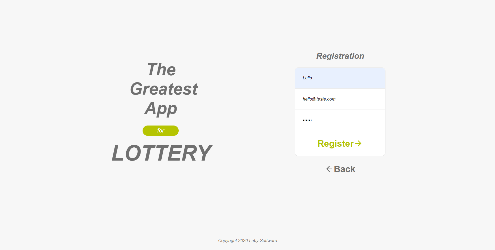
                                ResetPassword
  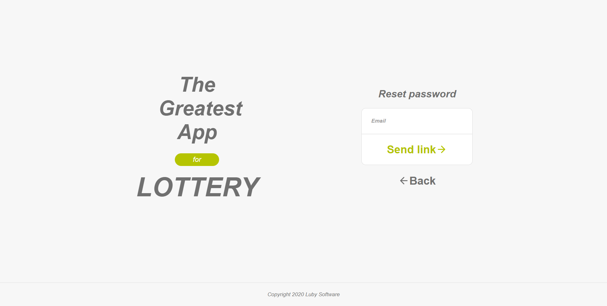
                                Dashboard
  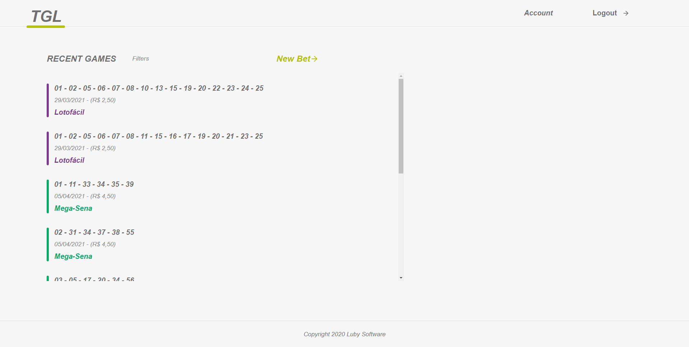
                                Account
  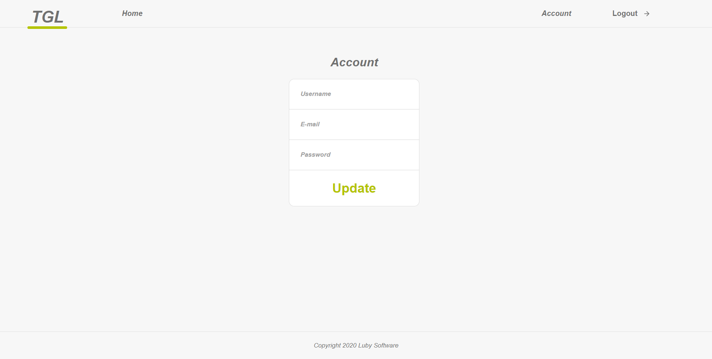
                                NewBet
  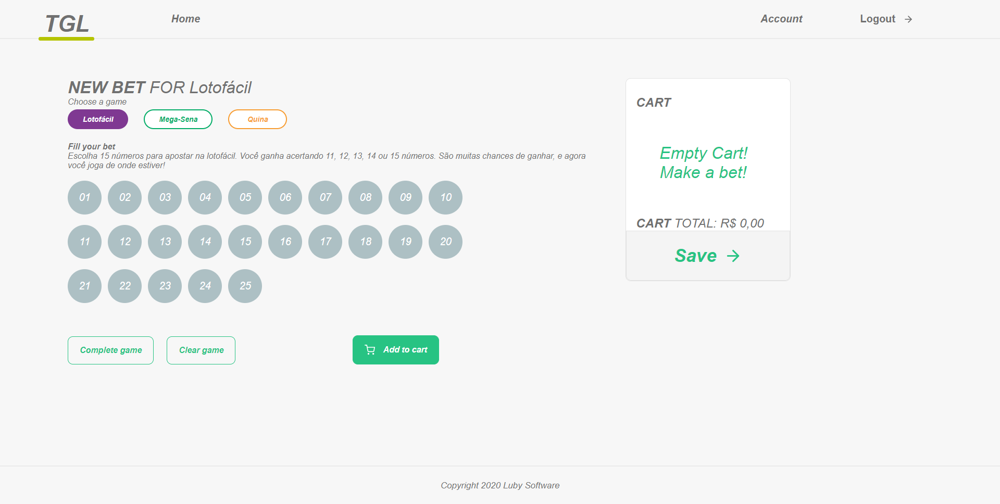     
                                WithBets
  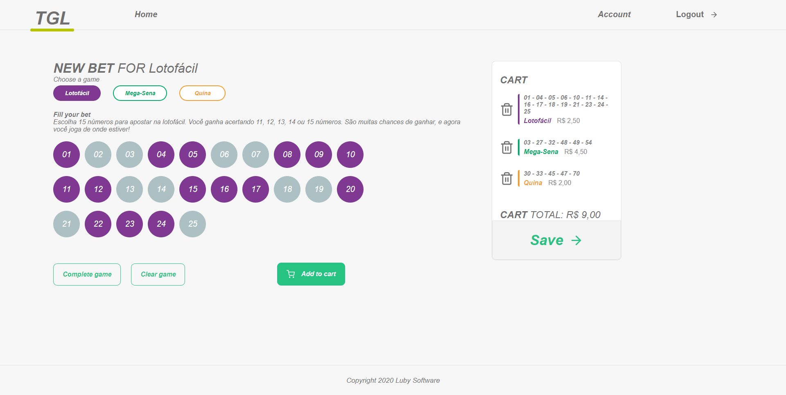
</p>
<br>

---

<br>

### Mobile

<p align="center">
                              
  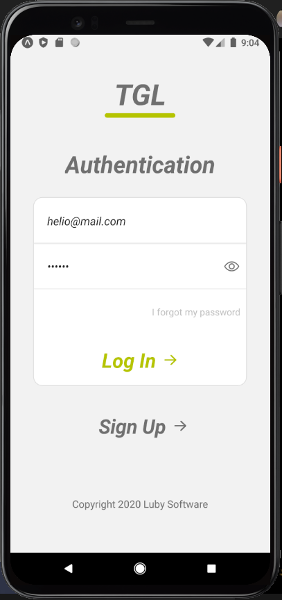
                                
  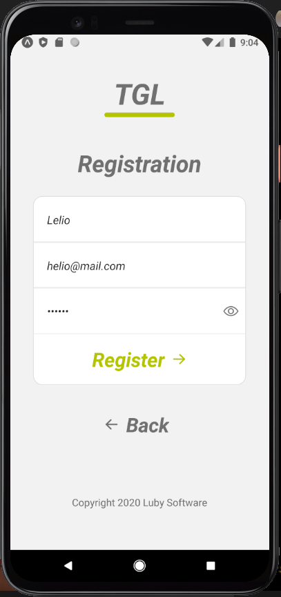
                               
  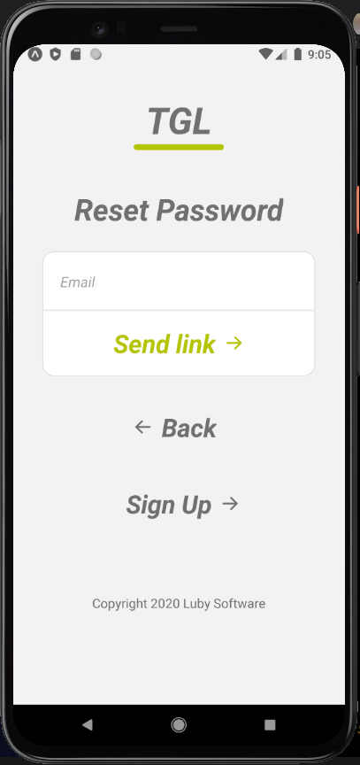
  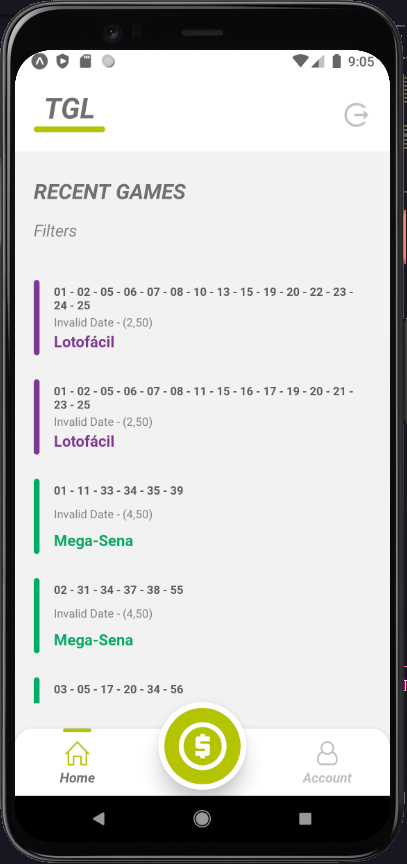
                               
  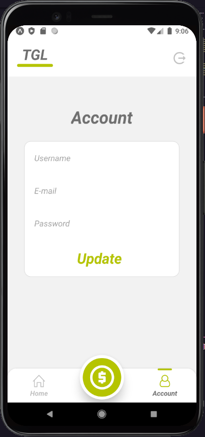
                                
  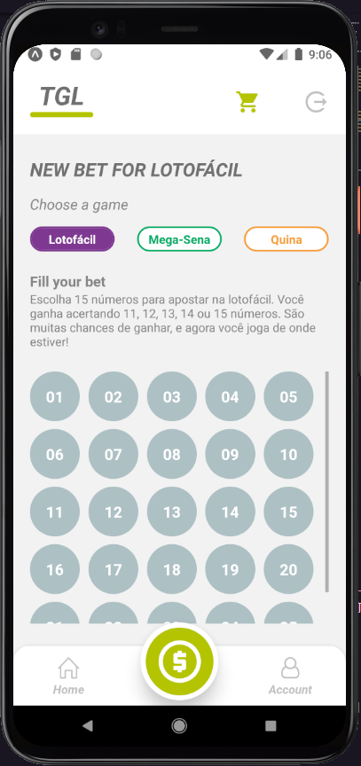
  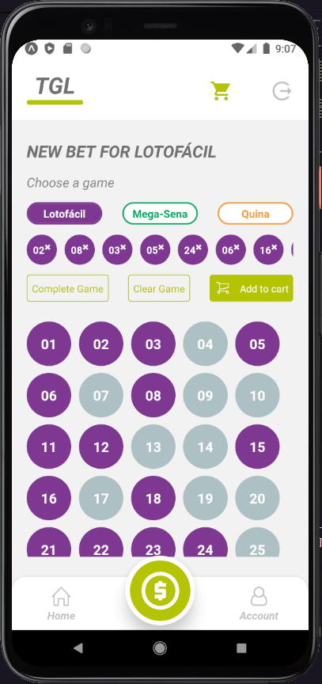
                              
  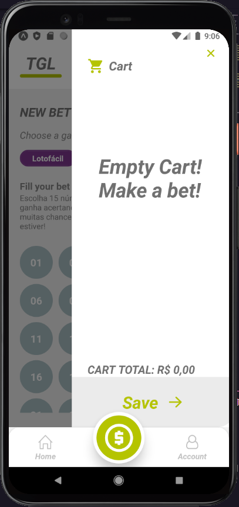
  

</p>
<br>
---

## Funcionalidades

- Login
- Registration
- ResetPassword
- Dashboard
- Account Settings
- New Bet
  <br>

---

### Clonando o Repositório

```bash

$ https://github.com/LelioH/TGL-Application

# entre na pasta do projeto

$ cd TGL-TheGreatestLottery

---

## 🛠️ Tecnologias

As ferramentas usadas no desenvolvimento do projeto.

#### Web
- JavaScript
- ReactJS 
- React Router Dom
- React Icons
- Axios

#### Backend:
- JavaScript
- NodeJS
- AdonisJS
- Yup

#### Mobile:
- JavaScript
- React Native
- Expo
- Axios

---
```
